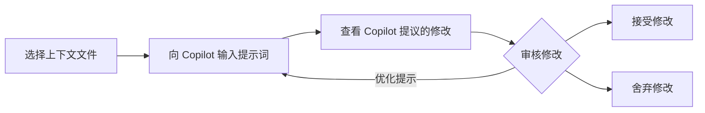

## Step 3: 使用编辑模式更快完成工作

在前步骤中，我们使用的 Copilot 功能需要人工介入的地方比较多，生成的结果主要是局部修改。现在，我们来探索 Copilot 的 **编辑模式**，它可以让你更全面地对整个仓库进行修改。

### 📖 Copilot 编辑模式

Copilot 的 **编辑模式(Edit Mode)** 和 **智能体模式(Agent Mode)** 都能基于自然语言在 **多个文件** 上进行修改，但两者略有区别。本步我们重点学习 **编辑模式**，下一步再探索 **智能体模式**。

编辑模式最适合用于 **目标明确**、你 **清楚修改范围** 的任务。

#### 编辑模式工作原理



1. **设置上下文**：选择 Copilot 在修改时应考虑的文件
2. **Copilot 提示词**：用自然语言描述需要的修改
3. **审核修改**：在代码中查看建议的改动
4. **接受或舍弃**：逐条审核修改并决定保留哪部分
5. **迭代**：如有需要，可提供后续指令进一步优化修改

### :keyboard: 实操环节: 用 Copilot 添加新功能! :rocket:

我们的网站已经列出了活动，但有哪些学生参与报名我们不知道 🤫

现在让我们 Copilot 修改功能，显示已报名的学生！

1.  Copilot Chat 窗口底部的下拉菜单切换到 **Edit 模式**

   

1. 打开网页相关文件，并将每个编辑窗口或文件拖入 Chat 面板，让 Copilot 将它们作为上下文参考：

   - `src/static/app.js`
   - `src/static/index.html`
   - `src/static/styles.css`

   

   > 💡 **Tip:** 你也可以通过 **Add Context...** 按钮添加其他类型的上下文来源，如 GitHub issue、整个代码库或终端输出。

1. 然后告诉 Copilot 更新代码，显示当前活动的参与者。

   > 
   >
   > ```prompt
   > Hey Copilot, can you please edit the activity cards to add a participants section.
   > It will show what participants that are already signed up for that activity as a bulleted list.
   > Remember to make it pretty!
   > ```

   - 文件名和编辑窗口旁会出现了新图标，表示有修改建议
   - 右下角会出现编辑建议面板，方便快速跳转并查看具体修改内容

      

      


1. 在接受修改前，请再次检查网站，确认所有更新正常显示。下面是更新后的活动卡片截图（可能需要重启应用或刷新页面）：

   

   > 🪧 **注意:** 你看到的活动卡片可能不同，Copilot 的结果不一定完全一致

   <details>
   <summary>遇到问题? 🤷</summary><br/>
   如果网站未正常加载，可检查以下内容：  

   - 重启 VS Code 调试器，确保最新版本的网站被加载
   - 如果忘记 URL 或关闭窗口，请回顾第 1 步
   - 尝试强制刷新网页或使用隐身窗口加载最新内容

   </details>

1. 确认修改正确后，依次查看每条建议修改并点击 **Keep** 应用

   > 💡 **Tip:** 可以直接接受建议，修改，或通过聊天界面提供额外指令进一步优化

1. 新功能完成后，请 **commit** 并 **push** 修改到 GitHub

1. 稍等片刻，Mona 会检查你的工作并给出下一步反馈。


<details>
<summary>遇到问题? 🤷</summary><br/>

如果未收到反馈，请检查：

- 是否将 `src/static/` 目录下的修改提交到 `accelerate-with-copilot` 分支，并推送到 GitHub
- 如果 Mona 发现错误，只需修正后再次推送，Mona 会多次检查你的修改

</details>
